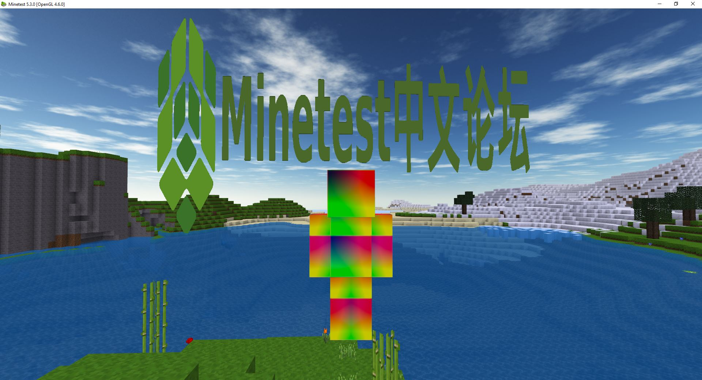
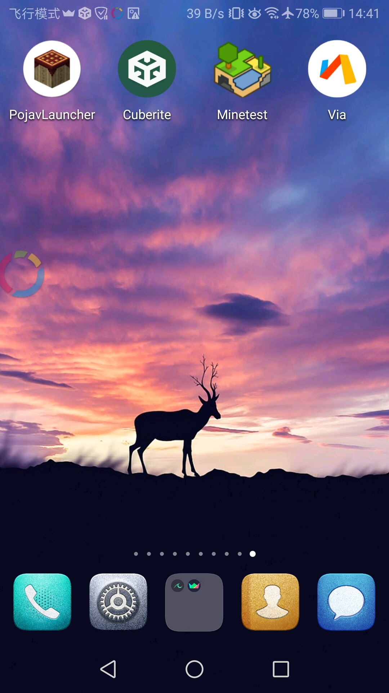
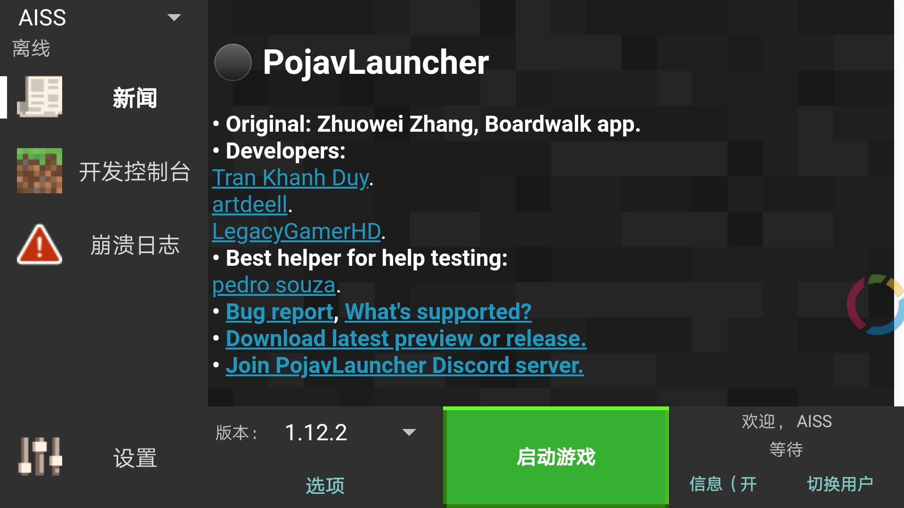
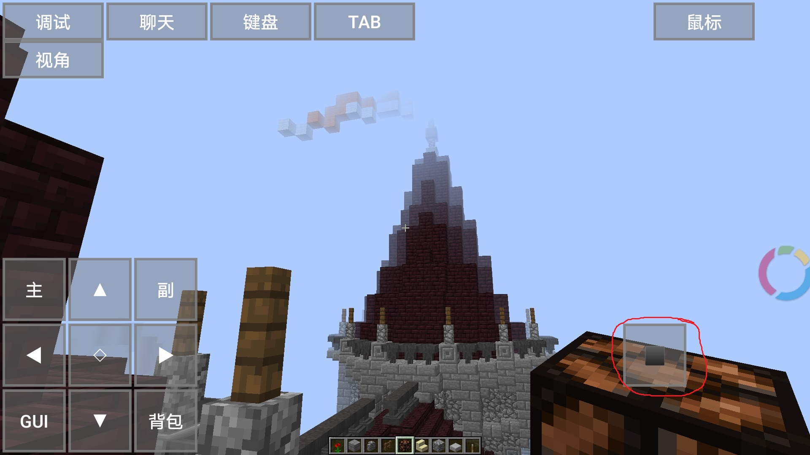
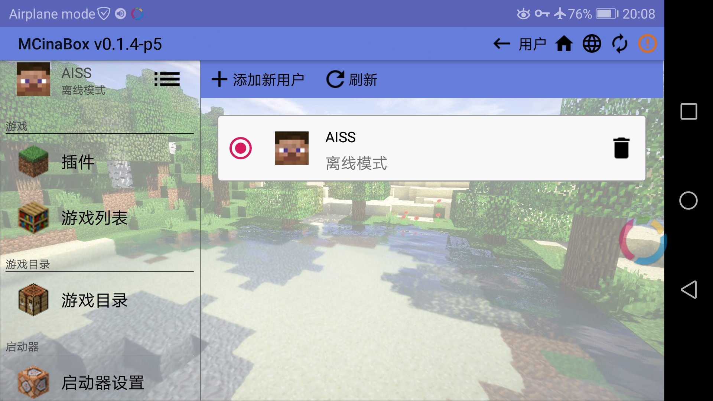
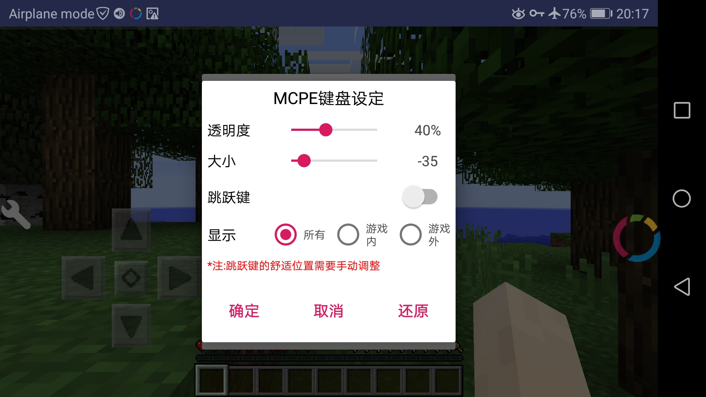
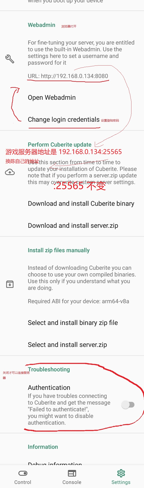
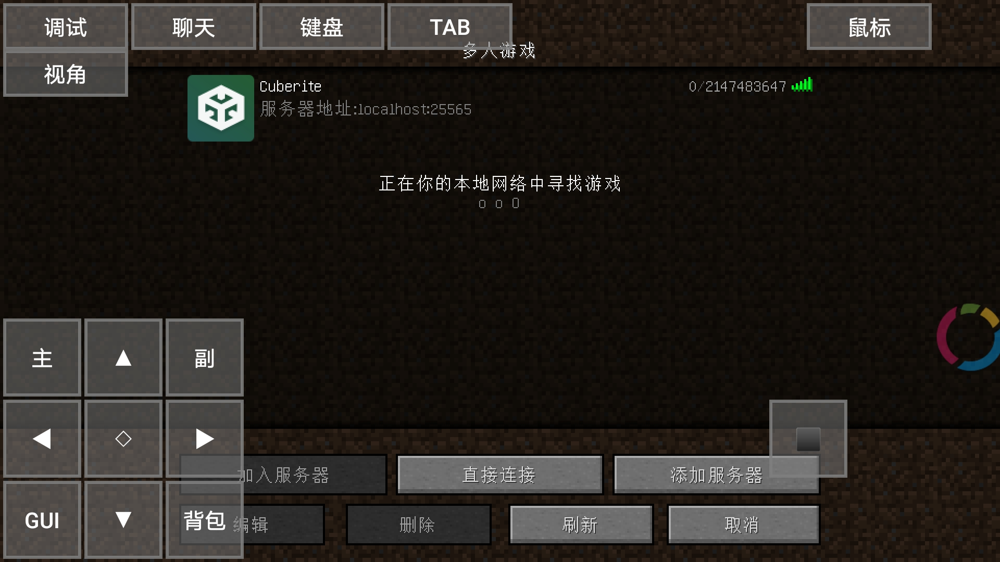

[]()
#
## `hello`
# 
[此项目的参与指南](./README.md)

[有什么问题Session联系我](https://rvlt.gg/discover/search?query=minetest)

**[免费永久域名是真正的分散域名，没有续费.](https://foreverdomains.io/)**
#


# [Minetest中文论坛](https://minetest.cosoc.cn/t/aiss-64-1024-px/270)


浏览器“ctrl+f”快速查找可能有助于按主题查找社区


## 目录


- [Minetest](#Minetest)
  - [Minetest 教程](#Minetest-教程)
  - [Minetest Python版](#Minetest-Python版)
- [我的世界](#我的世界)
  - [Minecraft Java 导入地图教程](#Minecraft-Java-导入地图教程)
  - [另一个 安卓java版](#另一个-安卓java版)
  - [基于BoatApp的安卓版](#基于BoatApp的安卓版)
    - [纹理包](#纹理包)
    - [光影](#光影)
  - [Win10 Java版](#Win10-Java版)
  - [创建Minecraft服务器](#创建Minecraft服务器)
  - [Minecraft Python 教程](#Minecraft-Python-教程)
  - [我的世界纹理包制作](#我的世界纹理包制作)
    - [Ferium](#Ferium)
  - [Minecraft 版本下载](#Minecraft-版本下载)
  - [我的世界论坛](#我的世界论坛)
  - [我的Minecraft书签分享](#我的Minecraft书签分享)
- [替代品](#替代品)
  - [QQ-微信-YY](#QQ-微信-YY)
  - [DNS](#DNS)
  - [翻译功能浏览器](#翻译功能浏览器)
  - [种子bt下载](#种子bt下载)
  - [垃圾百度](#垃圾百度)
  - [护眼蓝光滤镜](#护眼蓝光滤镜)
  - [网络加速 修改mtu](#网络加速-修改mtu)
  - [应用商店 搜索vpn](#应用商店-搜索vpn)
  - [游戏商店](#游戏商店)
    - [FPS游戏](#FPS游戏)
  - [录视频](#录视频)
  - [视频编辑](#视频编辑)
  - [视频压缩](#视频压缩)
  - [编曲](#编曲)
  - [OBS和直播平台](#OBS和直播平台)
  - [视频播放器](#视频播放器)
  - [bt播放器](#bt播放器)
  - [电脑垃圾清理](#电脑垃圾清理)
  - [驱动更新](#驱动更新)
  - [杀毒软件](#杀毒软件)
  - [输入法](#输入法)
  - [相机](#相机)
  - [文件管理器](#文件管理器)
  - [免费无限容量网盘github](#免费无限容量网盘github)
    - [贵族网盘](#贵族网盘)
	  - [临时网盘](#临时网盘)
  - [Github恶意删库](#Github)
  - [短链接](#短链接)
- [网站拦截](#网站拦截)
- [阻止windows更新](#阻止windows更新)
- [删除卸载windows自带应用内部应用](#删除卸载windows自带应用内部应用)
- [应用所有游戏](#应用所有游戏)
- [GNU/Linux 发行版](#GNU/Linux-distributions)
#
# Minetest
[回到目录 Emoji表情](https://github.com/guodongxiaren/README/blob/master/emoji.md)
*<div align="right"><a href="#目录">回到目录:maple_leaf: :cherries: :lemon: :strawberry: :peach: :eggplant: :pear: :corn: :tomato:</a></div>*
[Minetest中文论坛](https://minetest.cosoc.cn/t/aiss-64-1024-px/270) 
- 我使用的125个Minetest模组集成包 [mods](https://minetest.cosoc.cn/t/aiss-100-mod/351)
- 将我的世界地图转换为 [Minetest世界](https://minetest.cosoc.cn/t/minecraft-minetest-windows-10/292)
-  [我的世界巫师：诺维格勒](https://www.planetminecraft.com/project/novigrad-timelapse-download/) 转换后地图 [Novigrad.zip](https://github.com/Pantyhose-X/minetest_archive/releases)
#
#
- [minetest自定义人物模型](https://minetest.cosoc.cn/t/topic/280)
## [](https://www.bilibili.com/video/BV1Z54y1a7e4)
#

## Minetests是游戏盒。
* 已经有469个沙盒游戏了
* https://content.minetest.net/packages/?type=game
* https://forum.minetest.net/viewforum.php?f=48&sid=b18dce802f41feb1a13e8d788c1295fd
#
#
## 下载Minetest
[https://www.minetest.net/](https://www.minetest.net/)
#
## Minetest Python版
*<div align="right"><a href="#目录">回到目录</a></div>*
* https://github.com/miney-py
* https://github.com/sprintingkiwi/pycraft_mod
* https://github.com/miney-py/miney
* https://github.com/arpruss/raspberryjammod-minetest
#
## Minetest 教程
*<div align="right"><a href="#目录">回到目录</a></div>*
* Minetest服务器连接教程
* 有的服务器不需要输入密码。
* Nane/password名称密码、、随便什么,名称密码都可以、然后点Connect
* 再输入一次密码,必须相同、然后点Register and Join
* #
* #
# 如何在单人游戏中设置特权？/grant singleplayer all 或/grant singleplayer（特权名称)
* /help 查看命令
* /help all 根据您的权限列出服务器上可用的命令，以及每个命令的简短描述和语法参考
* /help privs 列出服务器上可能授予玩家的所有特权
* /grantme all 给自己全部特权。
* /grant 玩家名称 fly给指定玩家特权、或/grant 玩家名称 all
* /teleport 玩家名称 或者坐标/teleport (x,y,z)瞬间移动
* /time 21:00 时间设置、
* all     表示全部
* fly     表示飞行
* noclip  表示穿墙透视
* fast    表示快速移动
# 特权：https://wiki.minetest.net/Privileges/zh-hans
# 服务器命令：https://wiki.minetest.net/Server_commands/zh-hans
#

#
#
# 我的世界

##  Minecraft Java 导入地图教程
*<div align="right"><a href="#目录">回到目录</a></div>*

#
* 1、下载安卓Minecraft Java版。[PojavLauncher](https://github.com/PojavLauncherTeam/PojavLauncher/releases)
#

#
* 2、打开PojavLauncher选择地图对于的版本、启动游戏。
#

#
* 3、下载地图[planetminecraft](https://www.planetminecraft.com/project/novigrad-timelapse-download/) AISS的地图下载[AISS.zip](https://github.com/Pantyhose-X/Pantyhose-X/releases/tag/2)
* 4、下载、[Amaze File Manager](https://github.com/TeamAmaze/AmazeFileManager) 打开、 点击设置，点击显示隐藏文件。
* 5、使用Amaze File Manager把下载好的地图解压到 内部存储 games/PojavLauncher/.minecraft/saves/
* 6、启动游戏、点击单人游戏、就可以看到你导入地图了。
* 7、进入导入地图后，浮在空中什么都没有，你需要关闭飞行模式掉落到地面。
#

#
[PojavLauncher_iOS](https://github.com/PojavLauncherTeam/PojavLauncher_iOS)  iOS版
##  另一个 安卓java版 
*<div align="right"><a href="#目录">回到目录</a></div>*
* 1、下载 [MCinaBox](https://github.com/AOF-Dev/MCinaBox/releases/)
#

### 开始
* 2、首先，你需要创建一个用户。 请在 `左侧导航栏` - `用户` - `添加新用户` 来创建一个用户
* 3、其次，你需要下载Minecraft。 请在 `左侧导航栏` - `游戏列表` - `安装新游戏版本` 下载Minecraft游戏
* 4、请在左侧导航栏中选择启动器设置并安装运行库。aarch64-20200928.tar.xz 或 aarch32-20200928.tar.xz
[运行库下载](https://github.com/AOF-Dev/MCinaBox/releases/tag/v0.1.4-p2)
* 5、最后，你将要启动游戏。 请在`左侧导航栏` - `主页` 选择一个Minecraft版本并启动。
* 6、显示跳跃键
#

#
* 7、地图导入把下好的地图复制到。MCinaBox/gamedir/saves/
#
## 基于BoatApp的安卓版
*<div align="right"><a href="#目录">回到目录</a></div>*
* [【澪Ultimate】0.8发布](https://space.bilibili.com/35801833/dynamic) 下载地址在评论
* [HMCL-PE](https://github.com/Tungstend/HMCL-PE)
* [Boat_H2O2](https://github.com/NaCln4c1/Boat_H2O-v4)
* ~~[Boat Co2](https://github.com/JiuXia2025/Boat_CO2/blob/master/README-zh_CN.md)~~
#
#
### 纹理包
*<div align="right"><a href="#目录">回到目录</a></div>*
* https://www.planetminecraft.com/texture-packs/
* https://www.planetminecraft.com/texture-pack/nova-photorealism-8192x-ultra-hd/   8192x不是PC别用，这个是8K纹理包
#
### 光影
*<div align="right"><a href="#目录">回到目录</a></div>*
* 安卓使用Minecraft光影  视频设置、渲染距离超过15手机会坏的
* https://github.com/Open4Es
* https://github.com/ptitSeb
* https://www.bilibili.com/video/BV1q5411J73B
#
* PC使用Minecraft光影
* https://www.sonicether.com/seus/#downloads  
* https://sildurs-shaders.github.io/
* https://bitslablab.com/
#
#
## Win10 Java版
*<div align="right"><a href="#目录">回到目录</a></div>*
* HMCL是Minecraft启动器，支持Mod管理，游戏自定义，自动安装（Forge，LiteLoader和OptiFine），modpack创建，UI自定义等。
* [HMCL](https://hmcl.huangyuhui.net/)
* Epherome: 简单的Minecraft启动器
* [Epherome](https://github.com/ResetPower/Epherome)
#
#
## 创建Minecraft服务器
*<div align="right"><a href="#目录">回到目录</a></div>*
[cuberite](https://cuberite.org/)
### 导入地图
* 把Novigrad改成你的地图文件夹名称
* 1、把地图下载并提取到你的Cuberite/文件夹。
* 2、在settings.ini的`[Worlds]`下面添加World=Novigrad` [WorldPaths]` 下加 Novigrad=Novigrad
* 3、启动服务器，加入游戏，写/worlds 应该看得到Novigrad
* 4、输入 /portal Novigrad
* 5、现在得手工走到建筑的位置：/tp 883 62 1310
### 地图导入说明 https://github.com/cuberite/cuberite/issues/5126#issuecomment-779821638
* 管理服务器网站 localhost:8080
#

#

#

#

#
* 批量授权，进入服务器的“玩家”将被自动授予所有权限。
* 需要授权才可以破坏方块。
* https://github.com/cuberite/cuberite/issues/5126#issuecomment-780449476
* 进入Web界面，并将“默认”组的权限更改为“ * ” Add group

#

#

#
* 游戏模式	0表示生存模式，1表示创意模式，2表示冒险模式，3表示观众模式
* 使用命令修改游戏模式  /gamemode 1
* Win10版要修改 webadmin.ini  才可以登陆localhost:8080
* Win10版要修改Cuberite文件夹`settings.ini`里的改`Authenticate=0`才可以连接服务器
#

#
### P2P服务器
* https://github.com/GlowstoneMC/Glowstone
* https://www.youtube.com/watch?v=zNfPAgXS1M0
* https://www.youtube.com/watch?v=4Uuig3E8IXU
#
#
#
# 
## Minecraft Python 教程
*<div align="right"><a href="#目录">回到目录</a></div>*
* [Minecraft Python下载](https://github.com/arpruss/raspberryjammod)
https://imgchr.com/album/BKW6K
<!-- 地图下载[AISS.zip](https://github.com/Pantyhose-X/Pantyhose-X/releases/tag/2) -->
#

#
### Minecraft Python 书籍
* https://www.wiley.com/en-gb/Adventures+In+-c-7732
* https://www.wiley.com/WileyCDA/Section/id-823690.html
#
### Minecraft 版本下载
* [Minecraft Rust api](https://github.com/iceiix/stevenarella)
https://www.minebbs.com/resources/categories/55/
#
## 我的世界纹理包制作
*<div align="right"><a href="#目录">回到目录</a></div>*
* BOT https://github.com/prismarineJS
* 独立于语言的模块，为minecraft客户端、服务器和库提供minecraft数据。 https://github.com/PrismarineJS/minecraft-data
* .minecraft\versions\1.12.2\     `1.12.2.jar` 直接解压缩
* [Lospec](https://lospec.com/)
## Ferium
*<div align="right"><a href="#目录">回到目录</a></div>*
* Ferium的后端。它帮助管理来自Modrinth、CurseForge和Github发布的Minecraft mods
* https://github.com/theRookieCoder/ferium
* https://github.com/therookiecoder/libium
#
## 我的世界论坛
*<div align="right"><a href="#目录">回到目录</a></div>*
* https://www.fkgymc.com/
* https://klpbbs.com/forum.php?mod=viewthread&tid=5123&page=1&extra=#pid60235
* https://www.minebbs.com/members/aiss.15737/
* http://bbs.clouddream.online/
#
## 我的Minecraft书签分享
*<div align="right"><a href="#目录">回到目录</a></div>*
* [书签](/bookmarks.html)
* 下载bookmarks.html
* 导入浏览器或浏览器打开
#
#
#
#
#
#
# 替代品
#
#
## QQ-微信-YY
*<div align="right"><a href="#目录">回到目录</a></div>*
 替代病毒 QQ 微信 YY
* [Session](https://github.com/oxen-io)
* Session群 [列表](https://github.com/Pantyhose-X/awesome-session-group)
* 其他Session群 [列表](https://session.directory/)
* 其他Session群 [列表](http://lokilocker.com/Mods/Session-Groups/wiki/Session-Open-Groups)

* 游戏语音 [revolt.chat](https://app.revolt.chat/)
## DNS
*<div align="right"><a href="#目录">回到目录</a></div>*
* [DNS列表](/dns)
* [ControlD](https://controld.com/)
#
## vpn游戏加速器
*<div align="right"><a href="#目录">回到目录</a></div>*
* [Just Ceal It (可用于无代理合法过墙)](https://github.com/SpaceTimee/Sheas-Cealer)
* [thundervpn](http://thundervpn.com/)
* [com.noe.vp](http://www.notonearth.net/)
* vpn浏览器 [puffin](https://www.puffin.com/)
* vpn浏览器 [opera](https://www.opera.com/download)开启数据节省，就可以访问 https://www.google.com/ncr 
#
##  翻译功能浏览器
*<div align="right"><a href="#目录">回到目录</a></div>*
* PC [Yandex](https://browser.yandex.com/)
* PC [chromium](https://github.com/Hibbiki/chromium-win64)
* 安卓扩展chromium [kiwibrowser](https://github.com/kiwibrowser/src.next/releases)
* 安卓隐私chromium [bromite](https://github.com/bromite/bromite/releases)
* 安卓[duckduckgo](https://github.com/duckduckgo/Android/releases)
* [搜索引擎大全 浏览器大全](https://github.com/GNU-Linux-libre/Awesome-Browser-Search-Engine)
* 安卓 [火狐比官方的好](https://github.com/fork-maintainers/iceraven-browser/releases)
* 安卓 [Yandex](https://m.downloadatoz.com/yandex-browser-with-protect/com.yandex.browser/)
* 安卓 [mark.via.gp 4.2.3](https://apkpure.com/via-browser-fast-light-geek-best-choice/mark.via.gp/versions)
* 
#
#
#
## 浏览器插件
*<div align="right"><a href="#目录">回到目录</a></div>*
* https://www.gugeapps.net/
* http://www.crx4.com/
* https://chrome.zzzmh.cn/
* https://www.crx4chrome.com/
#
#
##  种子bt下载
*<div align="right"><a href="#目录">回到目录</a></div>*
* torrent [qBittorrent增强版](https://github.com/c0re100/qBittorrent-Enhanced-Edition/releases)
* torrent [安卓版](https://github.com/proninyaroslav/libretorrent)
文件下载器
* 32线程 [Neat Download Manager](https://www.neatdownloadmanager.com/index.php/en/)
* 扩展 [Neat Download Manager Extension](https://chrome.google.com/webstore/detail/neatdownloadmanager-exten/cpcifbdmkopohnnofedkjghjiclmhdah)
* 64线程下载器 [Motrix](https://github.com/agalwood/Motrix)
#
#
##  垃圾百度
*<div align="right"><a href="#目录">回到目录</a></div>*
* [搜索引擎大全 浏览器大全](https://github.com/GNU-Linux-libre/Awesome-Browser-Search-Engine)
* [brave](https://search.brave.com/)
* [duckduckgo](https://duckduckgo.com/)
* [mail.ru](https://go.mail.ru/)
* [ecosia](https://www.ecosia.org/)
* [ekoru](https://www.ekoru.org/)
* [auone.jp](https://portal.auone.jp/)
* [gigablast](https://www.gigablast.com/)
* [so-net.ne.jp](https://www.so-net.ne.jp/)
* [anoox](https://www.anoox.com/index.php)
* [ellpedia](https://en.ellpedia.com/search)
* [search](https://www.search.com/)
* [izito](https://www.izito.com/)
* [info](https://www.info.com/)
* [qmamu](https://qmamu.com/)
* [myway](https://hp.myway.com/)
* [mywebsearch](https://hp.mywebsearch.com/)
* [谷粉搜搜_九尾搜索_原谷粉搜搜](http://gfsoso.me)
* [LESO乐搜](https://leso.bar/)
* [Magi搜索](https://magi.com)
* [萌搜](https://mengso.com/)
* [GOOBE](https://goobe.io/)
#
#
## 护眼蓝光滤镜
*<div align="right"><a href="#目录">回到目录</a></div>*
* 安卓[Twilight](https://apkpure.com/twilight-blue-light-filter/com.urbandroid.lux)
* Windows 10[LightBulb](https://github.com/Tyrrrz/LightBulb)
* Linux[Redshift](https://github.com/jonls/redshift)
#
#
## 网络加速 修改mtu
*<div align="right"><a href="#目录">回到目录</a></div>*
* `netsh interface ipv4 show interfaces`   查看mtu
* `netsh interface ipv4 set subinterface "ethernet" mtu=9001 store=persistent`     （ethernet 你的网络适配器名称 store=persistent 永久 store=active 临时）  
* [mtu](https://support.microsoft.com/zh-cn/topic/%E4%B8%BA-mtu-%E5%A4%A7%E5%B0%8F%E4%BD%8E%E4%BA%8E-576-%E7%9A%84-wan-%E9%93%BE%E6%8E%A5%E6%8E%A8%E8%8D%90%E7%9A%84-tcp-ip-%E8%AE%BE%E7%BD%AE-2312050e-2a1b-1e89-94a1-b2868afa436f)
* https://www.cisco.com/c/zh_cn/support/docs/ip/generic-routing-encapsulation-gre/25885-pmtud-ipfrag.html
#
#
## 应用商店 搜索vpn
*<div align="right"><a href="#目录">回到目录</a></div>*
* [AuroraOSS](https://auroraoss.com/download/)
* [apkpure](https://apkpure.com)
* [Droid-ify](https://github.com/Iamlooker/Droid-ify)
* [F-Droid Classic](https://f-droid.org/en/packages/eu.bubu1.fdroidclassic/)
* [SkyDroid](https://github.com/redsolver/skydroid)
* [M-Droid](https://github.com/SkyzohKey/M-Droid)
* [G-Droid](https://f-droid.org/en/packages/org.gdroid.gdroid/)
* [Foxy Droid](https://github.com/kitsunyan/foxy-droid)
* [appteka](https://appteka.store/)
* [NetHunter App Store](https://store.nethunter.com/)
* [appvn](https://appvn.com/android)
* [slideme](http://slideme.org/)
* [sketchub](https://sketchub.in/)
* [https://palmplaystore.com/](https://palmplaystore.com/)
* [Mitch](https://f-droid.org/en/packages/ua.gardenapple.itchupdater/)
#
* [getjar](https://www.getjar.com/)
* [App分享](https://appshare.muge.info/)
* [兔兔助手](https://www.tutuapp.vip/pc/)
* [panda help](https://pandahelp.vip/)
* [happymod](https://happymod.com/)
* [blackmod](https://blackmod.net/blackmarket/)
* [AtoZ Downloader](https://aio.downloadatoz.com/)
* [ACMarket](https://ac-market.org/)
* [MoboPlay](https://www.moboplay.com/)
* [bazaar](https://cafebazaar.ir/app)
* [myket](https://myket.ir/?lang=en)
* [1Mobile Market](http://1mobile-market-download.com/)
* [9Apps](https://www.9apps.com/)
## 使用vpn才能打开
* [phoneky](https://phoneky.com/)
* [dmm games](https://games.dmm.com/en/)
* [APKMirror](https://f-droid.org/en/packages/taco.apkmirror/)
* [aptoide](https://www.aptoide.com/)
* [uptodown](https://en.uptodown.com/android)
* [blackmart](https://blackmart.co/)
* [Xposed store](https://repo.xposed.info/module/com.xposedstore.store.app)
* [원스토어](https://m.onestore.co.kr/mobilepoc/main/main.omp)
#
#
## 游戏商店
*<div align="right"><a href="#目录">回到目录</a></div>*
* [itch](https://itch.io/)

* [gamebanana](https://gamebanana.com/)
* [overwolf](https://www.overwolf.com/)
* [steam](https://store.steampowered.com/search/?term=fps&maxprice=free&category1=998)
* [playnite](https://playnite.link/)
* [Epic Games Store](https://store.epicgames.com/)
* [games](https://store.my.games/)
* [Linux游戏lutris](https://lutris.net/games/)
* [蘑菇下载器](http://www.wbini.com/)
* [Roblox](https://www.roblox.com/discover#/)
#
#
### FPS游戏
*<div align="right"><a href="#目录">回到目录</a></div>*
减少游戏ping使用[simple dnscrypt](https://simplednscrypt.org) \
[League_of_Maidens](https://store.steampowered.com/app/557180) \
[FPS游戏 Drakelings 社区](https://drakelings.bluedrake42.com/index.php)  \
[11个开源FPS游戏](https://alternativeto.net/software/counter-strike/?license=opensource&p=2)
---- ---
开源[Urban Terror](https://www.urbanterror.info/home/)  \
开源[Unvanquished](https://unvanquished.net/)  \
开源[Tremulous](https://darklegion.github.io/)  \
[Black_Squad 黑色小队 台湾版可以打中文](https://vfun.valofe.com/home) \
[Black_Squad 黑色小队](https://store.steampowered.com/app/550650) \
比csgo好玩[TO4_Tactical_Operations](https://store.steampowered.com/app/690980) \
[A.V.A steam版](https://store.steampowered.com/app/1473480) \
[HEAT REBORN 火线任务](https://store.steampowered.com/app/1219590) \
[死寂 Deathly Stillness](https://store.steampowered.com/app/1727650) \
[Nine_to_Five](https://store.steampowered.com/app/1408680) \
[Scavengers](https://store.steampowered.com/app/1183940) \
[10个开源FPS游戏](https://linux.cn/article-1506-1.html)  \
[其他fps](https://store.steampowered.com/search/?term=fps&maxprice=free&category1=998)
<!-- [Battle Shooter](https://store.steampowered.com/app/1861860/Battle_Shooter/) -->
练枪法[Aim_FTW](https://store.steampowered.com/app/1111300) \
练枪法[Aim_Lab](https://store.steampowered.com/app/714010)
#
#
## 录视频
*<div align="right"><a href="#目录">回到目录</a></div>*
* [ScreenToGif](https://github.com/NickeManarin/ScreenToGif)
* [Capture Screen](https://github.com/MathewSachin/Captura)
* [Screencast Capture Lite](https://github.com/cesarsouza/screencast-capture)
* [VokscreenNG](https://github.com/vkohaupt/vokoscreenNG)
* [iFun Screen Recorder](https://recorder.iobit.com/)
* [obs](https://obsproject.com/)
* 安卓 [Screen Recorder](https://github.com/yrom/ScreenRecorder)
* 安卓 [ScreenRecorder](https://gitlab.com/vijai/screenrecorder)
#
#
## 视频编辑 
* [Shotcut Vs Openshot Vs Kdenlive](https://www.bilibili.com/video/BV1Qi4y1x7Y8?spm_id_from=333.999.0.0&vd_source=ea998e5922f6bb21b7c7b852f67c94ba)
* [无损切割](https://github.com/mifi/lossless-cut)
* 安卓[Releases下载](https://github.com/SimformSolutionsPvtLtd/SSffmpegVideoOperation) 
* [DaVinci Resolve](https://www.blackmagicdesign.com/cn/products/davinciresolve)
#
#
## 视频压缩
视频压缩1GB压缩至200MB。F:\2022.mp4是你的视频文件， F:\2023.mp4是压缩后的文件
* [ffmpeg](https://ffmpeg.org/download.html#build-windows)
环境变量后
命令行 ffmpeg -i F:\2022.mp4 -c:v libx264 -preset veryslow -crf 18 F:\2023.mp4
#
#
## 编曲
[LMMS](https://space.bilibili.com/56147140/channel/seriesdetail?sid=217625)
#
#
## OBS和直播平台
*<div align="right"><a href="#目录">回到目录</a></div>*
* 基于OBS 录屏[streamlabs](https://streamlabs.com/)
* [OBS](https://obsproject.com/) OBS设置>输出>`CPU使用预设（高=较少CPU占用） `ultrafast` OBS设置>输出> `关键帧间隔{秒，0=自动}`2
* obs插件 只录游戏声音[win-capture-audio](https://github.com/bozbez/win-capture-audio) 玩游戏还可以听歌
* obs插件 同时在多个平台直播 [obs-multi-rtmp](https://github.com/sorayuki/obs-multi-rtmp)
#
* 开源直播平台[Glimesh](https://glimesh.tv/)
* [TwitCasting](https://twitcasting.tv/)
* 需要认证Google机器人[omlet中文](https://omlet.gg/)
* 需要认证Google机器人 [dlive](https://dlive.io)
* 日本[showroom](https://www.showroom-live.com/)
* 需要认证Google机器人[GoodGame](https://goodgame.ru/)
* 需要认证Google机器人[WASD.TV](https://wasd.tv/) 
* 摄像头直播 [earthcam](https://www.earthcam.com)
* 安装直播 [Dlive Protocol](https://dlive.org/) 教程[复制 直播密钥 和 服务器 到OBS](https://docs.dlive.org/docs/getting-started#setup-obs) 磁链 是观看直播的地址
* 我不推荐你使用theta直播 https://www.theta.tv 关闭应用程序里的 Cache compute 里的  Edge compute BETA
#
#
## 视频播放器
*<div align="right"><a href="#目录">回到目录</a></div>*
* [mpv](https://mpv.io/)
* [kmplayer](https://en.kmplayer.com/)
* [PotPlayer](https://potplayer.daum.net/)
* [jellyfin](https://jellyfin.org/)
#
#
## bt播放器
*<div align="right"><a href="#目录">回到目录</a></div>*
* [Soda Player](https://www.sodaplayer.com/)
* [powder.media](https://powder.media/)
* [webtorrent](https://webtorrent.io/)
* [在线服务器](https://github.com/XIU2/PeerflixServerZH)
* [BitLord](https://apkpure.com/bitlord-torrent-streamer-and-downloader/com.houseoflife.bitlord)
* [FrostWire](https://www.frostwire.com/)
* [Magnet Torrent Player](https://apkpure.com/magnet-torrent-player/com.iiplayer.sunplayer)
* [Amnis](https://apkpure.com/amnis-torrent-player/com.amnis)
* [xTorrent](https://apkpure.com/xtorrent-torrent-video-player/com.gamemalt.streamtorrentvideos)
* [TorrentTube](https://apkpure.com/torrenttube-torrent-streamer/com.victoriya.tortube)
* [TorrDroid](https://apkpure.com/torrdroid-torrent-downloader/intelligems.torrdroid)
* [闪电下载 无视资源审查](https://www.423down.com/9138.html)
#
#
## 电脑垃圾清理
*<div align="right"><a href="#目录">回到目录</a></div>*
* [Dism++](https://www.chuyu.me/en/index.html)
* [Advanced SystemCare](https://www.iobit.com/en/advancedsystemcarefree.php)
#

## 驱动更新
*<div align="right"><a href="#目录">回到目录</a></div>*
* [Driver Booster Free](https://www.filehorse.com/download-driver-booster-free/)
#
#
## 杀毒软件
*<div align="right"><a href="#目录">回到目录</a></div>*
* [IObit Malware Fighter](https://www.iobit.com/en/malware-fighter.php)
* [malwarebytes](https://www.malwarebytes.com/)
* [superantispyware](https://www.superantispyware.com/free-edition.html)
* [bitdefender](https://www.bitdefender.com/solutions/free.html)
* [comodo](https://www.comodo.com/?af=7639)
* [ikarussecurity](https://www.ikarussecurity.com/en/sdks-and-apis/ikarus-scan-engine/)
* [avast](https://www.avast.com/zh-cn/free-antivirus-download)
* [avira](https://www.avira.com/zh-cn/free-antivirus)
* [ZoneAlarm](https://www.zonealarm.com/software)
* 在线[hybrid](https://hybrid-analysis.com/)
* 在线[virustotal](https://www.virustotal.com/gui/home/upload)
* 在线[joesandbox](https://www.joesandbox.com/#windows)
* 在线[ID Ransomware](https://id-ransomware.malwarehunterteam.com/)
* 在线[opswat](https://metadefender.opswat.com/)
* 在线[nomoreransom](https://www.nomoreransom.org/en/index.html)
* 安卓[Anti-virus Dr.Web Light](https://play.google.com/store/apps/details?id=com.drweb&hl=en_US&gl=US)
* 安卓[AdGuard](https://m.shouji.com.cn/down/31270.html)
# 
#
#
#
## 输入法 
*<div align="right"><a href="#目录">回到目录</a></div>*
* [启程输入法](https://soime.cn/)
* [自然輸入法](https://www.goingpro.me/)
* [影子输入法](https://www.autoahk.com/archives/15117)
* [小狼毫](https://github.com/rime/weasel)
* 安卓[PlayKeyboard](https://apkpure.com/playkeyboard-hundreds-of-themes-just-for-you/kr.bitbyte.playkeyboard)
* 安卓[FlorisBoard](https://github.com/florisboard/florisboard)
* 安卓[AnySoftKeyboard](https://github.com/AnySoftKeyboard/AnySoftKeyboard)
* 安卓[OpenBoard](https://github.com/dslul/openboard)
* 安卓[Gboard](https://apkpure.com/gboard-the-google-keyboard/com.google.android.inputmethod.latin)
* 安卓[Typewise](https://apkpure.com/typewise-keyboard-i/ch.icoaching.typewise)
* 安卓[iTranslate Keyboard](https://apkpure.com/itranslate-keyboard/com.itranslate.keyboard.translator.android)
* 安卓[KingKeyboard](https://github.com/jenly1314/KingKeyboard)
* 剪贴板[Clip-Stack](https://github.com/heruoxin/Clip-Stack)
#
#
## 相机
*<div align="right"><a href="#目录">回到目录</a></div>*
* [Simple Camera](https://github.com/SimpleMobileTools/Simple-Camera)
* [Open Camera](https://apkpure.com/open-camera/net.sourceforge.opencamera)
* 禁止相机[NoCam Camera Blocker](https://apkpure.com/nocam-camera-blocker/mandarin.camerablocker)
* 禁止相机[com.ownzordage.chrx.lenscap](https://www.coolapk.com/apk/com.ownzordage.chrx.lenscap)
#
#
## 文件管理器
*<div align="right"><a href="#目录">回到目录</a></div>*
* 安卓[mixplorer](http://mixplorer.com/)
* 安卓[File Manager](https://f-droid.org/en/packages/com.github.axet.filemanager/)
* 安卓[Simple File Manager](https://github.com/SimpleMobileTools/Simple-File-Manager)
* 安卓[Amaze File Manager](https://github.com/TeamAmaze/AmazeFileManager)
* [FreeCommander XE](https://freecommander.com/en/summary/)
* [Explorer++](https://explorerplusplus.com/)
* [BetterExplorer](https://gainedge.org/better-explorer/)
* [file explorer](https://files.community/)
* [everything](https://voidtools.com)
* [Listary](https://www.listary.com)
#
#
## 免费无限容量网盘github
*<div align="right"><a href="#目录">回到目录</a></div>*
* 上传文件大小限制2GB
* 不限速
* 注册要用手机号接收验证码
* https://www.ecosia.org/search?q=%E5%85%8D%E8%B4%B9%E6%8E%A5%E7%9F%AD%E4%BF%A1
* 注册后创建，公有仓库，或私有仓库。
* 然后点Releases上传文件就可以。
* 视频类文件，建议用密码压缩后再上传。
* 建议使用标准的压缩软件，不使用标准的压缩软件压缩，会出现解压失败，文件就废了。
* Android：`ZArchiver `
* Win10： `7-Zip`
* 下载建议用多线程下载工具，
* Win10：`Neat Download Manager 1.2`
* Android：`IDM+`
#
### 贵族网盘、https://www.gueizu.com/
#
### 临时网盘
* 文叔叔、https://www.wenshushu.cn/
* 奶牛快传、 https://cowtransfer.com/ 总共支持 2.0GB 大小，单次上传最多支持 6 个文件同时上传，下载速度快，上传简单，无需注册，无广告，支持设置分享链接密码！ 奶牛快传免费用户可以保存 7 天。
* 100G三个月临时网盘、https://degoo.com/
* 2G网盘、https://www.mailbigfile.com/
* 2GB空间、https://www.hightail.com/
* 最大尺寸 每个档案	网页：1GB / FTP：10GB、http://dl.free.fr/
* 300GB网盘、https://1fichier.com/
* https://dropmeafile.com/
* 10G 12个月临时网盘、https://www.pcloud.com/
* 5G网盘、https://www.idrive.com/
#
#
#
## Github
*<div align="right"><a href="#目录">回到目录</a></div>*
**[Radicle is a peer-to-peer stack for building software together. Sound fun? Try it](https://radicle.xyz/)** \
**[decentragit uses decentralized ownership and storage to make it trivial to create a decentralized, shareable git remote of your project.](https://github.com/quorumcontrol/dgit)** \
**[Mango: Git, completely decentralised.](https://github.com/axic/mango)** \
**[A decentralization of GitHub using BitTorrent and Bitcoin](https://github.com/cjb/GitTorrent)** \
#
#
#
# 短链接
*<div align="right"><a href="#目录">回到目录</a></div>*
短链接 [bit](https://bitly.com) \
短链接[16个](https://www.affde.com/zh-CN/best-url-shortener-websites-to-earn-money.html)
#
#
#
#
# 网站拦截
*<div align="right"><a href="#目录">回到目录</a></div>*
[AdGuard](https://github.com/Pantyhose-X/Pantyhose-X/tree/main/Adguard) 和 [uBlock Origin](https://github.com/Pantyhose-X/Pantyhose-X/tree/main/Adguard) 和 [InviZible](https://github.com/Gedsh/InviZible)
#
- `||example.org^` - block access to the example.org domain and all its subdomains
- `||*.example^`- block access All prefixes  to domains  `.example`
- `||example.*^`- block access All suffixes to domains  `example.`
- `||*example*^`- block access All prefixes, midfixes, suffixes
- `@@||*example.org*^` - unblock access to the example.org domain and all its subdomains
- `0.0.0.0 example.org` - will now return 0.0.0.0 address for the example.org domain (but not its subdomains). Other IP 

ip range rules syntax `" "`  `*`
- `"0.0.0.0/24"` -block access to ip range   domains  `0.0.0.0/24`
- `"0.0.0.*"` -block access to  ip range Incremental domains  `0.0.0.*` 
-  `"0.0.0.0"` -block access to all domains whose CNAME response returns this IP address
#
#
* `||*这里输入要拦截字*^`拦截所有前缀，所有后缀、`*`表示所有、前缀，中缀、后缀

#
* `||这里输入ip.*^` 拦截ip范围
* 
#
* `||*.这里输入要拦截字^`拦截所有前缀
* 
#
* `||这里输入要拦截字.*^`只拦截后缀

#
#
#
#
#
## Win10系统
* [Snatch-Windows的剪贴板管理器](https://github.com/Idered/snatch)
* [YUMI 通用多系统安装程序](https://www.pendrivelinux.com/yumi-multiboot-usb-creator/)
* [隔离沙箱](https://sandboxie-plus.com/Sandboxie/)
* [资料下载](https://www.technipages.com/software-downloads)
#
# 阻止windows更新
*<div align="right"><a href="#目录">回到目录</a></div>*
阻止windows更新 删除以下目录的全部权限，属性>安全性>高级>所有者>输入>`Authenticated Users`>确定
- C:\Windows\SoftwareDistribution 
- C:\Windows\SoftwareDistribution\Datastore
- C:\Windows\SoftwareDistribution\Download
- C:\Windows\SoftwareDistribution\EventCachte.v2
- C:\Windows\SoftwareDistribution\PostRebootEventCache.V2
- C:\Windows\SoftwareDistribution\SLS
#
# 删除卸载windows自带应用内部应用
*<div align="right"><a href="#目录">回到目录</a></div>*
* 一条命令全部卸载 https://blog.51cto.com/u_15127615/4071213
* 删除间谍服务 [Destroy-Windows-10-Spying](https://github.com/Wohlstand/Destroy-Windows-10-Spying)
* [一键安装微软商店](https://github.com/JiuXia2025/OnekeyInstallWindowsStore)
#
# 应用所有游戏
*<div align="right"><a href="#目录">回到目录</a></div>*
* 游戏服务器断线解决方案
* 使用Windows防火墙可以屏蔽国家。游戏服务器
* https://www.gregsitservices.com/blog/2016/02/blocking-unwanted-countries-with-windows-firewall/
* win+r firewall.cpl 打开防火墙面板。   
* 开启或关闭windows Defender防火墙。
* 公共网络设置 阻止所有
#
* 不玩游戏 解封
* Windows Defender Firewall 高级设置 入站规则 出站规则 > 禁用规则
#
[我的阻止列表](https://github.com/zz1616611/aiss/releases/tag/Firewall)
[阻断中国所有IP范围](https://github.com/Pantyhose-X/Pantyhose-X/releases/tag/ip) 
- 点击[china.reg](https://github.com/Pantyhose-X/Pantyhose-X/releases/tag/ip)导入
- 删除防火墙规则
- 管理员打开注册表 HKEY_LOCAL_MACHINE\SYSTEM\CurrentControlSet\Services\SharedAccess\Parameters\FirewallPolicy\FirewallRules
- 重新启动电脑
#
#
#
#
#
# GNU/Linux distributions
*<div align="right"><a href="#目录">回到目录</a></div>*
- GNU Linux-libre
```
Parabola
Trisquel GNU/Linux
Hyperbola
Parrot os
BlackArch
ArchStrike
openSUSE
Debian
heads
```

- BSD
```
OpenBSD
GhosBSD
HardenedBSD
DragonFly BSD
FreeBSD
NetBSD
```
#
#
*<div align="right"><a href="#目录">回到目录:maple_leaf: :cherries: :lemon: :strawberry: :peach: :eggplant: :pear: :corn: :tomato:</a></div>*
